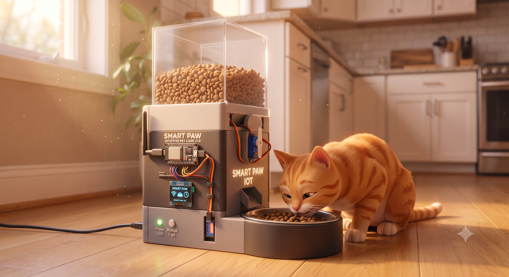
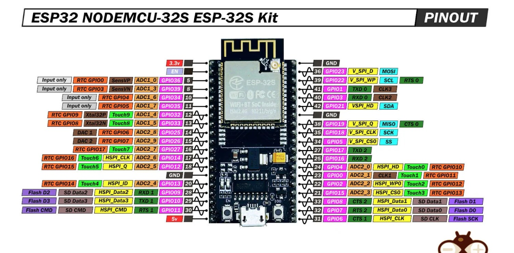

# Smart Pet Feeder

A smart, automated pet feeding system built using an **ESP32** microcontroller. This project uses a load cell for precise food measurement, servos for dispensing, and a keypad-driven LCD menu for scheduling and portion control. 

The firmware is developed using **PlatformIO** and the Arduino framework.

## Features
- **Real-Time Clock:** Setup current time on boot.
- **Precise Portion Control:** Input a target weight (in grams), and the system dispenses food using dual servos (food container servo and measure chamber servo) and an HX711 load cell amplifier.
- **Scheduled Feeding:** Set up to two distinct feeding times per day.
- **Interactive UI:** 20x4 I2C LCD and 4x4 keypad for an easy-to-use menu interface.
- **Smart Dispensing Logic:** Dispenses food into the measuring chamber 90 to 35 minutes before scheduled feeding times.
- **RFID Authentication:** Releases food from the chamber only when your pet's RFID tag is detected within 30 minutes of feeding time (or precisely at the scheduled time as a fail-safe).

## Hardware Components
- ESP32 Development Board
- 20x4 I2C LCD Display
- 4x4 Matrix Keypad
- Load Cell + HX711 Amplifier
- PCA9685 I2C PWM Servo Driver
- 2x Servos (for the food container and measurement chamber)
- MFRC522 RFID Reader

## Pin Configuration (ESP32)

| Component             | Pins Used                   |
| --------------------- | --------------------------- |
| **PCA9685 (Servos)**  | I2C (SDA, SCL)              |
| **Keypad Rows**       | GPIO 32, 33, 2, 4           |
| **Keypad Cols**       | GPIO 12, 13, 16, 17         |
| **HX711 (Load Cell)** | DT: GPIO 23, SCK: GPIO 26   |
| **RFID (MFRC522)**    | SS: GPIO 5, RST: GPIO 15    |
| **LCD (I2C)**         | SDA, SCL (Default I2C pins) |

## ESP32 Pinout

## Software Dependencies
The following libraries are required (automatically managed via `platformio.ini`):
- `marcoschwartz/LiquidCrystal_I2C`
- `chris--a/Keypad`
- `bogde/HX711`
- `adafruit/Adafruit PWM Servo Driver Library`
- `miguelbalboa/MFRC522`

## Usage / Menu Navigation

1. **Boot:** Enter the current time (HHMM) using the keypad and press `#` to confirm.
2. **Dashboard (Default Screen):** Displays Target Weight (TW), Current Weight (CW), Feed Times (F1 & F2), and the current Time.
3. **Menu System:** Press `C` from the dashboard to enter the inputs menu.
   - **Press A:** Set Target Weight (grams). Enter value and confirm with `#`.
   - **Press B:** Set Feed Times. Enter time for Feed 1 (HHMM), confirm with `#`, then enter Feed 2 (HHMM) and confirm with `#`.
   - **Press C:** Go back to the dashboard.
   - **Press *:** Reset all settings and values at any time.

## Calibration
Load cell calibration can be adjusted dynamically via the Serial Monitor (115200 baud).
- Send `+` to increase calibration factor by 10.
- Send `-` to decrease calibration factor by 10.
